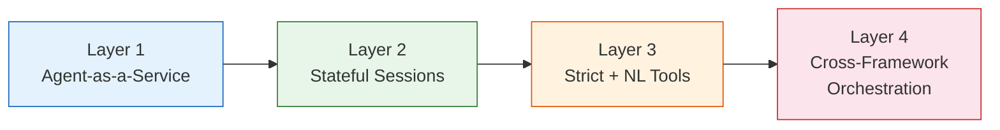

# MCP as the Universal Agent Interop Layer

## The Problem: Multi-Framework Reality

In any large organization, different teams build AI agents with different
frameworks. One team uses **LangGraph**, another uses **Microsoft Agent
Framework (MAF)**, a third runs **AutoGen** or **CrewAI**. Each
framework has its own agent abstractions, orchestration patterns, and
communication protocols.

When you need these agents to work together — a multi-agent workflow
where a business analyst agent hands off to a technical architect agent
built by a different team — the framework boundary becomes a wall.

**A2A (Agent-to-Agent protocol)** is the solution people typically reach
for. It defines agent cards, task lifecycles, and cross-agent messaging.
But in practice:

- **A2A adoption is still early.** Few production systems use it today.
- **Framework support is uneven.** Not all agentic frameworks have mature
  A2A implementations.
- **It adds conceptual overhead** — agent cards, task objects, streaming
  negotiation — for what often boils down to "call this agent and get a
  response."

Meanwhile, **MCP (Model Context Protocol)** is everywhere. Virtually
every major agentic framework — LangChain, LangGraph, MAF, AutoGen,
CrewAI, OpenAI Agents SDK — already speaks MCP. Every LLM platform
supports it. And the MCP specification now covers almost every capability
that A2A provides:

| Capability | MCP | A2A |
|---|---|---|
| Stateful sessions | ✅ `Mcp-Session-Id` | ✅ |
| Streaming | ✅ SSE | ✅ SSE |
| Long-running tasks (polling, cancellation, TTL) | ✅ | ✅ |
| Mid-task user input (elicitation) | ✅ | ✅ `INPUT_REQUIRED` |
| OAuth 2.1 + OIDC auth | ✅ | ✅ |
| Structured input/output schemas | ✅ JSON Schema | ❌ Descriptive only |
| Ecosystem adoption | 🟢 Every major LLM platform | 🟡 Growing |

So instead of waiting for A2A to mature, you can use what you already
have: **expose agents as MCP tool servers and consume them from any
framework, right now.**

## Two Design Patterns

This demo introduces two complementary patterns for cross-framework
agent interop over MCP:

### Pattern 1: Agent-as-Tool

Expose an external agent as an **MCP tool endpoint**. The consuming
agent calls it like any other tool — `call_tool("ask_expert", question)`
— and gets a typed response back. The caller has no idea what framework,
model, or infrastructure powers the tool.

This is the simplest pattern. It works for stateless queries, and with
MCP's session support (`Mcp-Session-Id`), it extends to stateful
multi-turn conversations as well.

### Pattern 2: Agent Adapter

Go further: wrap the MCP tool in an **adapter** that presents the remote
agent as a **native participant** in your framework's orchestration. The
adapter handles protocol translation, message extraction, and session
mapping so the orchestrator treats the remote agent identically to its
local agents.

In this demo, `MCPProxyAgent` adapts a LangGraph agent (running behind
MCP on a different port) into a native MAF agent. MAF's `GroupChatBuilder`
orchestrates it alongside local MAF agents — it cannot tell which
participant is local and which is remote, or which framework powers it.

This is the key insight: **you don't need A2A to do native multi-agent
orchestration across frameworks. MCP + an adapter gets you there.**

## What This Demo Proves

Each layer adds one capability, building to a cross-framework
multi-agent orchestration where the MCP boundary is invisible.



---

### Layer 1: Agent-as-a-Service (Scripts 1–2) — *Pattern 1: Agent-as-Tool*

> Any agent can be exposed as an MCP tool server. Any other agent can
> consume it. The caller doesn't know what's behind the tool.

```mermaid
sequenceDiagram
    participant Client as 🤖 Coordinator Agent<br/>(MAF)
    participant MCP as MCP Protocol<br/>(Streamable HTTP)
    participant Server as 🧠 Expert Advisor Agent<br/>(MAF, port 8002)

    Client->>MCP: call_tool("ask_expert", question)
    MCP->>Server: HTTP POST /mcp
    Server-->>MCP: Typed response
    MCP-->>Client: Result text

    Note over Client,Server: Client has no idea what framework,<br/>model, or infrastructure powers the tool
```



| Script | Role | Description |
|---|---|---|
| `mcp_server.py` | Server | MAF Agent with domain tools exposed as MCP endpoint on port 8002 |
| `mcp_client_agent.py` | Client | Coordinator agent that delegates to the remote agent via MCP |

---

### Layer 2: Stateful Sessions (Scripts 3–4)

> MCP sessions (`Mcp-Session-Id`) enable multi-turn conversations with
> remote agents. The server remembers context — no client-side history needed.

```mermaid
sequenceDiagram
    participant Client as 🤖 Client Agent
    participant Server as 🧠 Stateful MCP Server<br/>(port 8002)

    Client->>Server: call_tool("chat", Q1)<br/>Mcp-Session-Id: abc123
    Server-->>Client: R1
    Note right of Server: AgentSession[abc123]<br/>history: [Q1, R1]

    Client->>Server: call_tool("chat", Q2)<br/>Mcp-Session-Id: abc123
    Server-->>Client: R2 (references R1)
    Note right of Server: history: [Q1, R1, Q2, R2]

    Client->>Server: call_tool("chat", Q3)<br/>Mcp-Session-Id: abc123
    Server-->>Client: R3 (full context)
    Note right of Server: history: [Q1..R2, Q3, R3]
```



| Script | Role | Description |
|---|---|---|
| `mcp_server_stateful.py` | Server | Each MCP session → own `AgentSession` with accumulated history |
| `mcp_client_stateful.py` | Client | 3-turn conversation: risks → market data → executive summary |

---

### Layer 3: Strict + Natural Language Tools (Scripts 5–6)

> Real enterprise platforms need both machine-consumable (strict-schema)
> and human-consumable (natural-language) tools in the same endpoint.

```mermaid
graph TB
    subgraph MCP["Hybrid MCP Server (port 8002)"]
        direction TB
        subgraph Strict["🔧 Strict-Schema Tools"]
            T1["triage_alert<br/>raw text → SecurityAlert"]
            T2["assess_threat<br/>SecurityAlert → ThreatAssessment"]
            T3["create_response<br/>ThreatAssessment → IncidentResponse"]
        end
        subgraph NL["💬 Natural Language Tools"]
            T4["ask_security_advisor<br/>free-form Q&A"]
            T5["explain_for_customer<br/>incident → plain English"]
        end
        SS[("Shared Session State<br/>last_alert, last_threat,<br/>last_response")]
    end

    T1 --> T2 --> T3
    T3 -.-> SS
    SS -.-> T4
    SS -.-> T5

    style Strict fill:#e8f5e9,stroke:#2e7d32
    style NL fill:#e3f2fd,stroke:#1565c0
    style SS fill:#fff9c4,stroke:#f9a825
```



| Script | Role | Description |
|---|---|---|
| `mcp_server_hybrid.py` | Server | Pydantic-validated strict tools + NL tools, shared session state |
| `mcp_client_hybrid.py` | Client | Full SOC incident flow using both tool types in sequence |

---

### Layer 4: Cross-Framework Orchestration (Scripts 7–8) — *Pattern 2: Agent Adapter*

> MCP is framework-agnostic. A LangGraph agent behind MCP is
> indistinguishable from a MAF agent. The `MCPProxyAgent` adapter
> makes the framework boundary invisible to the orchestrator.

```mermaid
graph TB
    User["👤 User"]
    User --> GC

    subgraph GC["GroupChatBuilder (MAF Orchestration)"]
        Fac["🎯 Facilitator<br/>LLM Orchestrator<br/>decides who speaks"]

        Fac --> BS
        Fac --> TA
        Fac --> PL

        BS["👔 BusinessStrategist<br/>Local MAF Agent<br/>business impact, ROI, risk"]
        
        subgraph MCP_Bridge["MCP Boundary (port 8003)"]
            TA["🏗️ TechnicalArchitect<br/>MCPProxyAgent"]
            LG["LangGraph ReAct Agent<br/>+ MemorySaver"]
            TA -->|"call_tool(ask_architect)"| LG
        end

        PL["📋 Planner<br/>Local MAF Agent<br/>synthesizes plan"]
    end

    style GC fill:#fafafa,stroke:#333
    style MCP_Bridge fill:#fff3e0,stroke:#e65100
    style BS fill:#e3f2fd,stroke:#1565c0
    style PL fill:#e8f5e9,stroke:#2e7d32
    style TA fill:#fff3e0,stroke:#e65100
    style LG fill:#fce4ec,stroke:#c62828
    style Fac fill:#f3e5f5,stroke:#6a1b9a
```



**Conversation flow:**

```mermaid
sequenceDiagram
    participant U as 👤 User
    participant F as 🎯 Facilitator
    participant BS as 👔 BusinessStrategist<br/>(MAF)
    participant TA as 🏗️ TechnicalArchitect<br/>(LangGraph via MCP)
    participant PL as 📋 Planner<br/>(MAF)

    U->>F: "Migrate our e-commerce to cloud"
    F->>BS: Your turn
    BS-->>F: Business perspective & ROI
    F->>TA: Your turn
    Note right of TA: Proxy sends only latest msg<br/>LangGraph MemorySaver keeps history
    TA-->>F: Architecture & tech stack
    F->>PL: Synthesize the plan
    PL-->>F: Consolidated action plan
    F-->>U: ✅ Discussion complete

    U->>F: "What about risks and phasing?"
    F->>BS: Your turn
    BS-->>F: Risk analysis
    F->>TA: Your turn
    Note right of TA: Remembers prior discussion<br/>via MemorySaver
    TA-->>F: Migration phasing strategy
    F->>PL: Update the plan
    PL-->>F: Revised plan with risk mitigations
    F-->>U: ✅ Discussion complete
```



| Script | Role | Description |
|---|---|---|
| `mcp_server_langgraph.py` | Server | LangGraph ReAct agent as MCP server (port 8003), `MemorySaver` for statefulness |
| `workflow_group_chat.py` | Orchestrator | MAF GroupChat: 3 participants + LLM facilitator, multi-turn with predefined questions |

**This is the capstone.** Three execution models (local MAF, remote
LangGraph via MCP, LLM orchestrator) participate in the same conversation.
MAF's `GroupChatBuilder` treats all participants identically. The Agent
Adapter pattern made the framework boundary invisible.

---

## The Core Pattern

```mermaid
graph TB
    subgraph Orchestrator["Orchestrating Agent (any framework)"]
        O["MAF / LangChain / AutoGen / CrewAI"]
    end

    O -->|"call_tool()<br/>Pattern 1: Agent-as-Tool"| MCP1
    O -->|"call_tool()<br/>Pattern 1: Agent-as-Tool"| MCP2
    O -->|"Agent Adapter<br/>Pattern 2: Native Participant"| MCP3

    subgraph MCP1["MCP Server — Team Alpha"]
        A1["MAF Agent<br/>+ Azure OpenAI<br/>+ Domain Tools"]
    end

    subgraph MCP2["MCP Server — Team Beta"]
        A2["LangGraph ReAct Agent<br/>+ MemorySaver<br/>+ Architecture Tools"]
    end

    subgraph MCP3["MCP Server — Team Gamma"]
        A3["Any Framework<br/>+ Any Model<br/>+ Any Tools"]
    end

    style Orchestrator fill:#f3e5f5,stroke:#6a1b9a
    style MCP1 fill:#e3f2fd,stroke:#1565c0
    style MCP2 fill:#fff3e0,stroke:#e65100
    style MCP3 fill:#e8f5e9,stroke:#2e7d32
```



---

## Conceptual Architecture: MCP as the Agent Interop Bus

In production, teams across the organization publish their agents as MCP
servers. Consuming teams choose how to integrate:

- **As a tool** — call the remote agent like any function (`Pattern 1`)
- **As a native agent** — wrap it in an adapter so it participates in
  local multi-agent orchestration as a first-class citizen (`Pattern 2`)

```mermaid
graph TB
    subgraph Registry["Agent / MCP Discovery Layer"]
        D["MCP Server Registry<br/>(catalog of available agent-tools)"]
    end

    subgraph Publishers["Agent Publishers"]
        P1["Team A<br/>MAF Agent → MCP Server"]
        P2["Team B<br/>LangGraph Agent → MCP Server"]
        P3["Team C<br/>CrewAI Agent → MCP Server"]
        P4["Team D<br/>Custom Agent → MCP Server"]
    end

    P1 -->|publish| D
    P2 -->|publish| D
    P3 -->|publish| D
    P4 -->|publish| D

    subgraph Consumers["Agent Consumers"]
        direction TB
        subgraph C1["Consumer — Pattern 1: Agent-as-Tool"]
            CA1["Any Agent (any framework)"]
            CA1 -->|"call_tool()"| TOOL["Remote Agent<br/>used as a tool"]
        end
        subgraph C2["Consumer — Pattern 2: Agent Adapter"]
            CA2["Multi-Agent Orchestration"]
            CA2 --> AD["Agent Adapter"]
            AD -->|"wraps MCP tool as<br/>native agent"| NATIVE["Remote Agent<br/>participates as native<br/>agent in orchestration"]
        end
    end

    D -->|discover| CA1
    D -->|discover| CA2

    style Registry fill:#fff9c4,stroke:#f9a825
    style Publishers fill:#e8f5e9,stroke:#2e7d32
    style C1 fill:#e3f2fd,stroke:#1565c0
    style C2 fill:#fce4ec,stroke:#c62828
    style AD fill:#fff3e0,stroke:#e65100
```



**The key idea:** every team publishes agents through MCP servers. Every
consuming team — regardless of their framework — can discover and use
those agents either as tools (simple, stateless or stateful calls) or as
native participants in their own multi-agent orchestrations (via the
Agent Adapter pattern). No A2A required. No framework lock-in. The
protocol everyone already supports becomes the universal interop layer.

## Quick Start

### Prerequisites

- Python 3.12+, [uv](https://docs.astral.sh/uv/)
- Azure OpenAI credentials in `mcp/.env`

### Running the demos

```bash
cd agentic_ai/agents/mcp_agent_demo
uv sync
```

#### Layer 1 — Basic Agent-as-MCP-Service

```bash
# Terminal 1
uv run python mcp_server.py             # port 8002

# Terminal 2
uv run python mcp_client_agent.py
```

#### Layer 2 — Stateful Multi-Turn Sessions

```bash
# Terminal 1 (stop Layer 1 first — same port)
uv run python mcp_server_stateful.py    # port 8002

# Terminal 2
uv run python mcp_client_stateful.py
```

#### Layer 3 — Hybrid Strict + NL Tools

```bash
# Terminal 1 (stop Layer 2 first — same port)
uv run python mcp_server_hybrid.py      # port 8002

# Terminal 2
uv run python mcp_client_hybrid.py
```

#### Layer 4 — Cross-Framework Group Chat

```bash
# Terminal 1
uv run python mcp_server_langgraph.py   # port 8003

# Terminal 2
uv run python workflow_group_chat.py
```

> **Note:** Layers 1–3 share port 8002 — run one at a time. Layer 4 uses
> port 8003 and can run alongside any of the others.

## Technologies

| Package | Purpose |
|---------|---------|
| [agent-framework-core](https://github.com/microsoft/agent-framework) | Microsoft Agent Framework — agents, tools, MCP client |
| [agent-framework-orchestrations](https://github.com/microsoft/agent-framework) | GroupChatBuilder for multi-agent workflows |
| [fastmcp](https://github.com/jlowin/fastmcp) | PrefectHQ FastMCP v3 — stateful MCP server with session support |
| [langgraph](https://github.com/langchain-ai/langgraph) | Stateful agent graphs with MemorySaver |
| [langchain-openai](https://github.com/langchain-ai/langchain) | Azure OpenAI integration for LangGraph |

## File Inventory

```
mcp_agent_demo/
├── mcp_server.py              # Layer 1: MAF agent as MCP server
├── mcp_client_agent.py        # Layer 1: Client consuming the MCP service
├── mcp_server_stateful.py     # Layer 2: Stateful MCP server (session memory)
├── mcp_client_stateful.py     # Layer 2: Multi-turn conversation client
├── mcp_server_hybrid.py       # Layer 3: Strict-schema + NL tools
├── mcp_client_hybrid.py       # Layer 3: SOC incident flow
├── mcp_server_langgraph.py    # Layer 4: LangGraph agent as MCP server
├── workflow_group_chat.py     # Layer 4: GroupChat — MAF + LangGraph via MCP
├── pyproject.toml
└── README.md
```

## License

MIT
