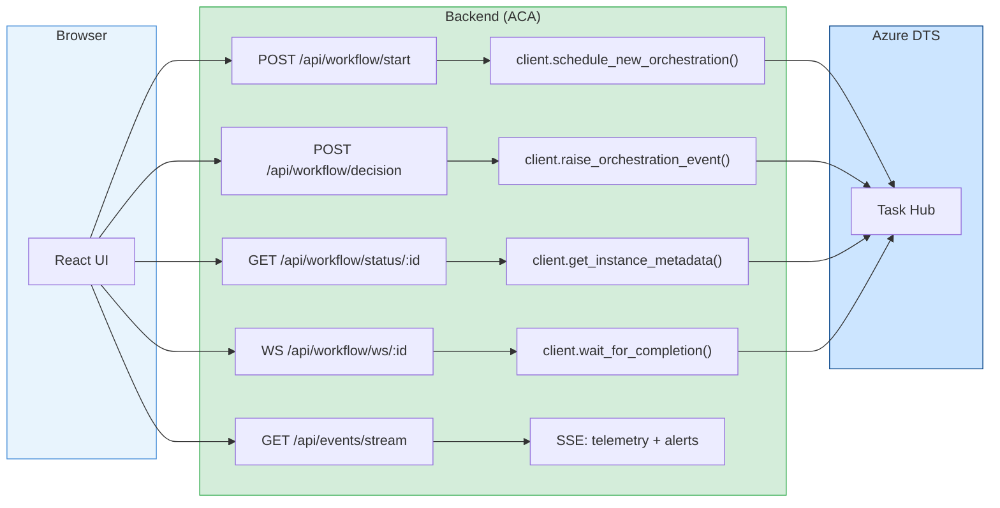
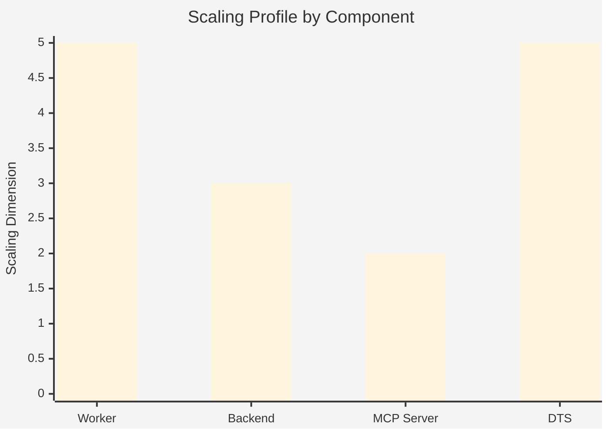

# Production Architecture — Azure Container Apps

> **Audience:** Platform engineers & architects taking this workshop demo to production.
> Jump back to the [Workshop README](README.md) for local development setup.

---

## Overview

The workshop runs four processes on `localhost`. In production every process maps to an **Azure Container App (ACA)** revision — but the topology is _not_ uniform. The worker has **no ingress at all**; the MCP server is **internal-only**; and the backend is the **sole external surface**.

```mermaid
%%{init: {'theme': 'base', 'themeVariables': { 'primaryColor': '#4A90D9', 'primaryTextColor': '#fff', 'primaryBorderColor': '#2E6BA4', 'lineColor': '#5C6B77', 'secondaryColor': '#F5A623', 'tertiaryColor': '#E8F4FD'}}}%%
flowchart TB
    subgraph INTERNET["☁️ Internet"]
        USER["🧑‍💻 Analyst / Browser"]
    end

    subgraph AZURE["Azure Subscription"]
        subgraph ACA_ENV["Azure Container Apps Environment"]
            direction TB

            subgraph BACKEND["Backend (ACA)<br/>── only external ingress ──"]
                BE_APP["FastAPI BFF<br/>REST + SSE + WebSocket<br/>Port 8001"]
            end

            subgraph WORKER["Worker (ACA)<br/>── NO ingress ──"]
                W_APP["DTS Worker<br/>Pull-based gRPC<br/>FraudAnalysisAgent Entity<br/>Orchestration + Activities"]
            end

            subgraph MCP_SVC["MCP Server (ACA)<br/>── internal-only ingress ──"]
                MCP_APP["FastMCP<br/>Contoso Tools<br/>Port 8000"]
            end
        end

        DTS["🔷 Azure Durable Task<br/>Scheduler (DTS)<br/>──────────────<br/>Task Hub · Event Store<br/>Timer Service"]
        AOAI["🤖 Azure OpenAI<br/>gpt-4o / gpt-5"]
        COSMOS["🗄️ Cosmos DB<br/>Customer Data<br/>(replaces SQLite)"]
        EVENTHUB["📡 Event Hubs<br/>Real Telemetry<br/>(replaces synthetic producer)"]
        APPINS["📊 Application Insights<br/>OpenTelemetry"]
        SWA["🌐 Azure Static Web Apps<br/>React UI"]
    end

    USER -->|"HTTPS"| SWA
    SWA -->|"API calls"| BE_APP
    USER -->|"REST / SSE / WS"| BE_APP

    BE_APP -->|"gRPC (schedule_new_orchestration,<br/>raise_event, get_instance)"| DTS
    W_APP -.->|"gRPC PULL<br/>(long-poll for work items)"| DTS
    W_APP -->|"Streamable HTTP"| MCP_APP
    W_APP -->|"Chat Completions API"| AOAI
    MCP_APP -->|"Data queries"| COSMOS
    EVENTHUB -->|"Ingested by"| BE_APP

    BE_APP -.->|"traces"| APPINS
    W_APP -.->|"traces"| APPINS

    style INTERNET fill:#f0f4f8,stroke:#ccc
    style AZURE fill:#e8f4fd,stroke:#2E6BA4,stroke-width:2px
    style ACA_ENV fill:#fff,stroke:#4A90D9,stroke-width:2px
    style BACKEND fill:#d4edda,stroke:#28a745
    style WORKER fill:#ffeeba,stroke:#ffc107
    style MCP_SVC fill:#d6d8db,stroke:#6c757d
    style DTS fill:#cce5ff,stroke:#004085
    style AOAI fill:#e2d5f1,stroke:#6f42c1
    style COSMOS fill:#fff3cd,stroke:#856404
    style EVENTHUB fill:#f8d7da,stroke:#721c24
    style APPINS fill:#d1ecf1,stroke:#0c5460
    style SWA fill:#d4edda,stroke:#155724
```

---

## Component Deep-Dive

### 1. Worker — No Ingress, Pull-Based

| Property | Value |
|----------|-------|
| **Ingress** | None — no HTTP port exposed |
| **Communication** | Outbound gRPC to DTS (long-poll for work items) |
| **Scaling trigger** | KEDA scaler watching DTS task-hub queue depth |
| **Min replicas** | 1 (must always be polling) |
| **Max replicas** | 10+ (each replica pulls independently) |
| **Identity** | Managed Identity — `DefaultAzureCredential()` |

The worker **never receives inbound requests**. It calls `worker.start()` which opens a persistent gRPC stream to DTS, pulling orchestration work items, activity tasks, and entity operations. When there's nothing to do, it simply blocks on the long-poll.

```mermaid
sequenceDiagram
    participant DTS as Azure DTS
    participant W as Worker (ACA)
    participant AOAI as Azure OpenAI
    participant MCP as MCP Server

    loop Pull-based work loop
        W->>DTS: gRPC: GetWorkItems() [long-poll]
        DTS-->>W: WorkItem (orchestration / activity / entity)

        alt Orchestration step
            W->>W: Replay event history → resume generator
            W->>DTS: CompleteOrchestration(actions=[])
        else Entity operation (agent call)
            W->>MCP: Streamable HTTP (MCP tools)
            MCP-->>W: Tool results
            W->>AOAI: Chat Completions (with tool results)
            AOAI-->>W: Assessment JSON
            W->>DTS: CompleteEntity(state=DurableAgentState)
        else Activity task
            W->>W: Execute activity function
            W->>DTS: CompleteActivity(result)
        end
    end
```

> **Key insight:** Because the worker has no ingress, there is **zero attack surface**. The only way to make the worker do something is to schedule an orchestration in DTS — which requires the `Durable Task Data Contributor` RBAC role.

### 2. MCP Server — Internal-Only

| Property | Value |
|----------|-------|
| **Ingress** | Internal only (ACA environment VNET) |
| **Consumers** | Worker only |
| **Protocol** | Streamable HTTP (`/mcp`) |
| **Data store** | Cosmos DB (replaces SQLite) |
| **Identity** | Managed Identity to Cosmos DB |

The MCP server exposes Contoso business tools (customer lookup, transaction history, subscription details). In the workshop it uses SQLite; in production, swap the backend module to Cosmos DB — the MCP tool surface stays identical.

### 3. Backend — The Only External Surface

| Property | Value |
|----------|-------|
| **Ingress** | External HTTPS (public or VNET-integrated) |
| **Role** | Backend-for-Frontend (BFF) |
| **APIs** | REST, SSE, WebSocket |
| **DTS interaction** | gRPC client (schedule, query, raise events) |
| **Identity** | Managed Identity to DTS |

The backend translates browser-friendly protocols into DTS SDK calls:

### 4. React UI — Static Web App

The React UI is a static bundle (no server rendering). In production, deploy to **Azure Static Web Apps** with an API proxy rule routing `/api/*` to the Backend ACA.

---

## What Changes From Workshop to Production?

```mermaid
%%{init: {'theme': 'base', 'themeVariables': { 'primaryColor': '#4A90D9'}}}%%
flowchart LR
    subgraph WORKSHOP["Workshop (localhost)"]
        direction TB
        W_DTS["Docker DTS Emulator<br/>localhost:8080"]
        W_MCP["MCP + SQLite<br/>localhost:8000"]
        W_WORKER["Worker process"]
        W_BACKEND["Backend process<br/>localhost:8001"]
        W_UI["Vite dev server<br/>localhost:3000"]
        W_EVENTS["Synthetic event_producer.py"]
    end

    subgraph PRODUCTION["Production (Azure)"]
        direction TB
        P_DTS["Azure DTS<br/>Managed service"]
        P_MCP["MCP + Cosmos DB<br/>Internal ACA"]
        P_WORKER["Worker ACA<br/>No ingress"]
        P_BACKEND["Backend ACA<br/>External HTTPS"]
        P_UI["Static Web App"]
        P_EVENTS["Event Hubs<br/>Real telemetry"]
    end

    W_DTS -.->|"Same SDK, change endpoint"| P_DTS
    W_MCP -.->|"Swap SQLite → Cosmos"| P_MCP
    W_WORKER -.->|"Same code, add MI"| P_WORKER
    W_BACKEND -.->|"Same code, add MI"| P_BACKEND
    W_UI -.->|"npm build → deploy"| P_UI
    W_EVENTS -.->|"Replace with real data"| P_EVENTS

    style WORKSHOP fill:#fff3cd,stroke:#856404,stroke-width:2px
    style PRODUCTION fill:#d4edda,stroke:#28a745,stroke-width:2px
```

### Code Changes Required

| Component | Change | LOC Impact |
|-----------|--------|------------|
| **Worker** | `DTS_ENDPOINT` env var → Azure URL | 0 lines (config only) |
| **Worker** | `DefaultAzureCredential()` already used when not localhost | 0 lines |
| **Backend** | Same as worker | 0 lines |
| **MCP Server** | Swap `_backend_sqlite.py` → `_backend_cosmos.py` | ~1 import line |
| **UI** | `npm run build` → deploy static files | 0 lines |
| **Event Producer** | Replace with Event Hubs consumer | ~50 lines (new module) |

> **Total:** Near-zero code changes. The architecture was designed for this — `DTS_ENDPOINT` is the only knob.

---

## Security Model

```mermaid
flowchart TB
    subgraph IDENTITY["🔐 Managed Identity"]
        MI_WORKER["Worker MI"]
        MI_BACKEND["Backend MI"]
        MI_MCP["MCP MI"]
    end

    MI_WORKER -->|"Durable Task Data Contributor"| DTS["Azure DTS"]
    MI_WORKER -->|"Cognitive Services OpenAI User"| AOAI["Azure OpenAI"]
    MI_BACKEND -->|"Durable Task Data Contributor"| DTS
    MI_MCP -->|"Cosmos DB Data Reader"| COSMOS["Cosmos DB"]

    subgraph NETWORK["🌐 Network"]
        EXT["External Traffic"] -->|"HTTPS only"| BE["Backend"]
        BE -->|"Internal VNET"| MCP_S["MCP Server"]
        WORKER_S["Worker"] -->|"Internal VNET"| MCP_S
        WORKER_S -.->|"Outbound gRPC"| DTS
    end

    style IDENTITY fill:#e2d5f1,stroke:#6f42c1,stroke-width:2px
    style NETWORK fill:#e8f4fd,stroke:#4A90D9,stroke-width:2px
```

**Key principles:**
- **No API keys in production** — Managed Identity everywhere
- **No secrets in environment variables** — `DefaultAzureCredential()` auto-discovers MI
- **Worker has zero ingress** — no attack surface, pull-only
- **MCP server is internal-only** — not reachable from internet
- **Backend is the sole entry point** — all external traffic funneled through one surface

---

## Scaling Characteristics

| Component | Scaling Model | Trigger | Notes |
|-----------|--------------|---------|-------|
| **Worker** | Horizontal (KEDA) | DTS queue depth | Each replica pulls independently. Stateless — all state lives in DTS. |
| **Backend** | Horizontal (HTTP) | Request count / CPU | Standard HTTP scaling. SSE connections are long-lived. |
| **MCP Server** | Horizontal (HTTP) | Request count | Stateless tool calls. Scale with worker count. |
| **DTS** | Managed service | Automatic | Microsoft manages partitioning and throughput. |

### Why the Worker Scales So Well

The worker is **completely stateless**. All durable state — orchestration event logs, entity state (`DurableAgentState`), timers, external events — lives in DTS storage. When you add a second worker replica:

1. It calls `worker.start()` and begins long-polling DTS
2. DTS distributes work items across all connected workers
3. Any replica can pick up any orchestration — replay rebuilds state from the event log
4. If a replica dies, its in-progress work item times out and another replica picks it up

This is the same model Azure Durable Functions uses at massive scale.

---

## Deployment Checklist

- [ ] Provision Azure DTS (Consumption SKU) + Task Hub
- [ ] Provision Azure Container Apps Environment with VNET
- [ ] Deploy Worker ACA (no ingress, MI enabled)
- [ ] Deploy MCP Server ACA (internal ingress, MI enabled)
- [ ] Deploy Backend ACA (external ingress, MI enabled)
- [ ] Assign RBAC: Worker MI → `Durable Task Data Contributor` on DTS
- [ ] Assign RBAC: Backend MI → `Durable Task Data Contributor` on DTS
- [ ] Assign RBAC: Worker MI → `Cognitive Services OpenAI User` on Azure OpenAI
- [ ] Assign RBAC: MCP MI → Cosmos DB `Data Reader` role
- [ ] Deploy React UI to Static Web Apps with proxy to Backend
- [ ] Configure Event Hubs for real telemetry ingestion
- [ ] Enable Application Insights for all containers
- [ ] Test: `provision_dts.ps1` covers DTS + RBAC steps

---

## Cost Estimation (Consumption Tier)

| Resource | SKU | Estimated Monthly Cost |
|----------|-----|----------------------|
| Azure DTS | Consumption | Pay-per-execution (~$0.01/1K orchestrations) |
| ACA Worker | Consumption | Pay-per-vCPU-second (idle = ~$0) |
| ACA Backend | Consumption | Pay-per-request |
| ACA MCP Server | Consumption | Pay-per-request |
| Azure OpenAI | Pay-as-you-go | ~$0.01–0.03 per investigation |
| Cosmos DB | Serverless | Pay-per-RU |
| Static Web Apps | Free tier | $0 |
| Application Insights | Pay-per-GB | First 5GB/month free |

> For a low-volume fraud detection system (~100 alerts/day), expect **< $50/month** total.

---

*Back to [Workshop README](README.md)*
