# Durable Agentic Workflows — A Design Pattern for Long-Running AI Agent Orchestration

## The Problem: AI Agents That Must Not Forget

Most AI agent demos run in a single request-response cycle: user asks, agent thinks, agent answers. But real-world agent systems need to do things that take **minutes, hours, or days** — and they must survive failures along the way.

Consider what happens when an AI agent needs to:

- **Monitor transactions 24/7 for fraud** — continuously ingest telemetry events, detect anomalies in real time, autonomously launch multi-agent investigations, then wait for a human analyst to approve or reject the recommended action (which might take hours or happen over a weekend). This is an *ambient agent* — it runs in the background with no user prompt, watching for patterns that require intervention
- **Manage an IT incident** — detect anomaly, triage severity, page on-call engineer, wait for acknowledgment (with escalation if no response in 15 minutes), coordinate remediation steps, produce post-mortem
- **Process a loan application** — pull credit reports, verify employment, run compliance checks in parallel, wait for underwriter approval, then execute the disbursement
- **Orchestrate a supply chain order** — validate inventory across warehouses, reserve stock, calculate shipping, wait for supplier confirmation, handle partial fulfillments, retry failed shipments

These scenarios share a common trait: **no human initiates the work**. Events arrive continuously — transactions, alerts, sensor readings, log entries — and the agent must watch, decide, act, and sometimes wait for human input before proceeding. This is fundamentally different from chatbot-style "user asks, agent answers" interactions.

These are **long-running, multi-step, stateful workflows** where:

1. **Human decisions inject unbounded delays** — an analyst might respond in 5 minutes or 5 days
2. **Multiple agents collaborate** — a router dispatches to specialists, an aggregator synthesizes results
3. **Failures are inevitable** — processes crash, containers restart, VMs get preempted, network connections drop
4. **Actions must not be repeated** — you can't lock a bank account twice or charge a customer twice because the worker restarted

The fundamental question is: **when the process running your agent dies, what happens to all the work it already completed?**

---

## Why Building This Yourself Is Harder Than You Think

The instinct is to reach for familiar tools: "I'll just checkpoint my state to a database or blob storage." This works for simple linear flows, but falls apart in real agent orchestration scenarios. Here are the five problems you'll need to solve — and each one is a distributed systems project in its own right.

### 1. The Wait-for-Human Problem

Your orchestration reaches a point where it needs a human decision. The agent has produced a risk assessment; now an analyst must approve or reject.

**DIY approach:** Save current state to blob → poll a database for the decision → resume.

**What goes wrong:**
- You need an event subscription system: when the analyst submits a decision via your API, something must correlate that decision back to the specific waiting orchestration instance
- You need a timeout mechanism: if no decision arrives in 72 hours, escalate automatically
- You need both to race: whichever fires first (human decision or timeout) wins, and the other must be cancelled cleanly
- All of this must survive process restarts — the timer can't live in `asyncio`; the event subscription can't live in a Python dict

With a durable orchestrator, this is one line:

```python
winner = yield when_any([
    context.wait_for_external_event("AnalystDecision"),
    context.create_timer(timedelta(hours=72))
])
```

The event subscription, the timer, and the race — all persisted in the orchestrator's storage, not in worker memory.

### 2. The Replay/Resume Problem

Your workflow has 8 steps. It crashed after step 5. How do you resume at step 6?

**DIY approach:** Save a `current_step` counter → on restart, load it → use a giant if/elif chain to jump to the right step.

**What goes wrong:**
- Each step's *output* was consumed by later steps. You need to save every intermediate result, not just the step number
- If your workflow has branches (`if risk > 0.6: wait for human; else: auto-clear`), the if/elif chain grows exponentially
- If your workflow has loops (analyst rejects → re-investigate → wait again), the state machine becomes nearly impossible to maintain
- Every time you change the workflow logic, you must update the resume logic in lockstep

With a durable orchestrator, there is no resume logic. The framework **replays your function from the beginning**, returning cached results for completed steps and suspending at the first incomplete step. Your code is the state machine.

### 3. The Concurrency Problem

Multiple worker instances are running (for scale). Two workers pick up the same orchestration after a restart.

**DIY approach:** Distributed locks via Redis or blob leases → acquire before processing → release after.

**What goes wrong:**
- Lock expiration vs. long-running work: if the LLM call takes 30 seconds and your lock expires at 15, another worker enters
- Deadlocks when one worker holds lock A and waits for lock B while another holds lock B and waits for lock A
- Partial completion: worker acquires lock, completes 3 of 5 steps, crashes — now you have half-done state and need rollback

A durable orchestrator manages concurrency internally via its event store — each orchestration instance has an atomic event stream with built-in sequencing.

### 4. The Exactly-Once Side Effects Problem

Step 5 is "lock the customer's bank account." The worker executed it, but crashed before recording that it succeeded.

**DIY approach:** Idempotency keys for every side effect → check before executing → mark after.

**What goes wrong:**
- You need an idempotency store separate from your state store (they must be updated atomically or you get inconsistencies)
- Every activity function must be wrapped with idempotency-key generation, lookup, and recording
- The pattern is different for every external system (REST API idempotency key vs. database upsert vs. message dedup)

A durable orchestrator treats activities as **events in an append-only log**. If the worker crashes after the activity completes but before it records the result, the replay will see the completion event and skip re-execution automatically.

### 5. The Stateful Agent Conversation Problem

Your agent needs to re-investigate with full context: the original alert, its first analysis, the analyst's feedback. This conversation must persist across process restarts and even across multiple reject-reinvestigate cycles.

**DIY approach:** Serialize the chat history to blob/database → load on each call → append → save.

**What goes wrong:**
- Concurrent writes: two activities might try to update the same conversation simultaneously
- You need optimistic concurrency (ETags) or pessimistic locking
- Schema evolution: as your agent's message format changes, old serialized conversations must still deserialize
- Garbage collection: conversations that are complete should eventually be pruned

A durable orchestrator with **entity state** (like DTS entities) handles all of this: atomic reads/writes, built-in concurrency control, and structured state that the framework manages.

---

### The Honest Assessment

| Concern | DIY Blob/DB Checkpointing | Durable Orchestrator (DTS) |
|---------|---------------------------|---------------------------|
| Simple linear pipeline, no human wait | ✅ Works fine, less infra | ⚠️ Overkill |
| Human-in-the-loop with timeout | 🔴 Build entire event system | ✅ `when_any([event, timer])` |
| Crash recovery with branches/loops | 🔴 Exponential state machine | ✅ Automatic replay |
| Multi-worker concurrency | 🔴 Distributed locks | ✅ Built-in event sequencing |
| Exactly-once side effects | 🔴 Idempotency infrastructure | ✅ Activity completion log |
| Persistent agent conversations | 🟡 Possible but manual | ✅ Entity state with concurrency |

**Bottom line:** If your agent workflow is a straight-line script with no human waits, DIY checkpointing works. The moment you add human-in-the-loop, branching, loops, or multi-step crash recovery, you're building a workflow engine — and building a *correct* one is a multi-year distributed systems project.

---

## Enter: Azure Durable Task Scheduler (DTS)

The [Azure Durable Task Scheduler](https://learn.microsoft.com/en-us/azure/durable-task-scheduler/) is a managed service that provides exactly the primitives needed for durable agent orchestration:

```mermaid
%%{init: {'theme': 'base', 'themeVariables': { 'primaryColor': '#4A90D9', 'primaryTextColor': '#fff' }}}%%
flowchart LR
    subgraph DTS_SCOPE["🔷 What DTS Provides"]
        direction TB
        DS1["📋 Persistent task queue"]
        DS2["📝 Event store — append-only log"]
        DS3["⏱️ Timer service — survives restarts"]
        DS4["🗃️ Entity state storage"]
        DS5["📦 Work item distribution"]
        DS6["🔁 At-least-once delivery"]
    end

    subgraph WORKER_SCOPE["🔧 What Your Code Provides"]
        direction TB
        WS1["🐍 Compute runtime — Python"]
        WS2["🤖 LLM calls — Azure OpenAI"]
        WS3["🔌 Tool calls — MCP, APIs"]
        WS4["📊 Business logic — orchestration"]
        WS5["🧩 Agent framework integration"]
    end

    DTS_SCOPE ~~~ WORKER_SCOPE

    style DTS_SCOPE fill:#cce5ff,stroke:#004085,stroke-width:2px
    style WORKER_SCOPE fill:#ffeeba,stroke:#ffc107,stroke-width:2px
```

**DTS is a persistent task queue + event store + timer service.** It doesn't run your code — it stores the *record of what happened* and *dispatches work items* to workers. Your worker is a **stateless compute runtime** that pulls tasks, executes your Python/LLM/MCP logic, and reports results back. If the worker dies, DTS still has the full event log; a new worker replays it and picks up where things left off.

### Key Properties

| Property | How It Works |
|----------|-------------|
| **Checkpointing** | Every `yield` in your orchestration writes a completion event to DTS's append-only log |
| **Crash recovery** | Worker replays the orchestration function; completed yields return cached results instantly |
| **Human-in-the-loop** | `wait_for_external_event()` creates a subscription in DTS storage — survives indefinitely |
| **Timers** | `create_timer(72h)` fires in DTS's timer service — not in your process memory |
| **Entity state** | Agent conversation history persisted as a structured entity, with atomic updates |
| **Scaling** | Multiple workers pull from the same task hub — DTS distributes work items |

### Development Experience

DTS ships a **local emulator** as a Docker container, so you develop and test locally without an Azure subscription:

```bash
# Local development — zero cloud dependency
docker run -d --name dts-emulator -p 8080:8080 mcr.microsoft.com/dts/dts-emulator:latest

# Production — same SDK, same code, just change the endpoint
DTS_ENDPOINT=https://your-dts.northcentralus.durabletask.io
```

---

## Reference Architecture: Ambient Fraud Detection

To prove these patterns, we built a complete fraud detection system that exercises every durable orchestration primitive: fan-out/fan-in agents, human-in-the-loop with timeout, stateful feedback loops, and crash recovery.

### The 3-Layer Design

```mermaid
%%{init: {'theme': 'base', 'themeVariables': { 'primaryColor': '#4A90D9', 'primaryTextColor': '#fff', 'lineColor': '#5C6B77' }}}%%
flowchart TB
    subgraph LAYER1["🟢 Layer 1 — Detection · Ambient Monitoring"]
        direction LR
        TELEMETRY["📊 Telemetry<br/>Generator<br/><i>2–5s interval</i>"]
        RULES["⚡ Rule Engine<br/><i>Python, no LLM</i><br/>• Multi-country login<br/>• Spending spike > 3×<br/>• Burst API calls<br/>• Repeated auth failures"]
        SUBMIT["🚨 Auto-submit<br/>POST /api/workflow/start"]
        SSE_OUT["📺 SSE Stream<br/>→ React Live Feed"]

        TELEMETRY --> RULES
        RULES -->|"anomaly detected"| SUBMIT
        TELEMETRY -->|"all events"| SSE_OUT
        RULES -->|"flagged events"| SSE_OUT
    end

    subgraph LAYER2["🔵 Layer 2 — Investigation · Durable Agent Orchestration"]
        direction TB
        ORCH["🔷 DTS Orchestration<br/><i>checkpointed, crash-recoverable</i>"]

        subgraph ENTITY["dafx-FraudAnalysisAgent Entity"]
            direction TB
            INNER["Inner Workflow<br/><i>(fast, async, in-memory)</i>"]

            subgraph FANOUT["Fan-out / Fan-in"]
                direction LR
                ROUTER["AlertRouter"] --> USAGE["📈 Usage<br/>Analyst"]
                ROUTER --> LOCATION["🌍 Location<br/>Analyst"]
                ROUTER --> BILLING["💳 Billing<br/>Analyst"]
            end

            USAGE -->|"MCP tools"| AGG["🧠 FraudRisk<br/>Aggregator<br/><i>(LLM)</i>"]
            LOCATION -->|"MCP tools"| AGG
            BILLING -->|"MCP tools"| AGG
            AGG --> ASSESSMENT["📋 FraudRisk<br/>Assessment"]

            INNER --- FANOUT
        end

        ORCH -->|"yield fraud_agent.run()"| ENTITY
    end

    subgraph LAYER3["🟠 Layer 3 — Decision & Action · HITL + Execution"]
        direction TB
        RISK_CHECK{"Risk ≥ 0.6?"}

        subgraph HITL_LOOP["HITL Feedback Loop<br/><i>durable, stateful, crash-safe</i>"]
            direction TB
            NOTIFY["📧 Notify Analyst<br/><i>DTS Activity</i>"]
            WAIT["⏳ Wait for Decision<br/><i>when_any(event, 72h timer)</i><br/><b>Survives process death</b>"]
            DECIDE{"Analyst<br/>Decision?"}
            EXECUTE["✅ Execute Action<br/><i>DTS Activity</i>"]
            REINVEST["🔄 Re-investigate<br/><i>same session = full history</i>"]
            TIMEOUT_ACT["⏰ Escalate Timeout<br/><i>DTS Activity</i>"]
        end

        AUTO_CLEAR["🟢 Auto-clear<br/><i>DTS Activity</i>"]
        FINAL["📨 Send Notification<br/><i>DTS Activity</i>"]

        RISK_CHECK -->|"YES"| NOTIFY
        NOTIFY --> WAIT
        WAIT --> DECIDE
        DECIDE -->|"Approve"| EXECUTE
        DECIDE -->|"Reject + feedback"| REINVEST
        DECIDE -->|"Timeout"| TIMEOUT_ACT
        REINVEST -->|"loop back"| NOTIFY
        RISK_CHECK -->|"NO"| AUTO_CLEAR

        EXECUTE --> FINAL
        TIMEOUT_ACT --> FINAL
        AUTO_CLEAR --> FINAL
    end

    SUBMIT -->|"triggers"| ORCH
    ENTITY -->|"risk score"| RISK_CHECK

    style LAYER1 fill:#d4edda,stroke:#28a745,stroke-width:2px
    style LAYER2 fill:#cce5ff,stroke:#004085,stroke-width:2px
    style LAYER3 fill:#fff3cd,stroke:#856404,stroke-width:2px
    style ENTITY fill:#e8f4fd,stroke:#4A90D9
    style HITL_LOOP fill:#ffeeba,stroke:#ffc107
    style FANOUT fill:#f0f4f8,stroke:#adb5bd
```

### Why This Layering?

| Layer | Uses LLM? | Durable? | Rationale |
|-------|-----------|----------|-----------|
| **Layer 1** — Detection | ❌ No | ❌ No | Events arrive every 2–5s. An LLM call takes 2–5s and costs money. Simple rules catch 95% of benign events at zero cost. |
| **Layer 2** — Investigation | ✅ Yes | ✅ Yes (entity) | Complex multi-signal reasoning is the LLM's strength. Entity state persists the full conversation for re-investigation. |
| **Layer 3** — Decision | ❌ No | ✅ Yes (orchestration) | Human decisions can take hours/days. DTS timers and external events survive crashes and restarts. |

### Service Topology

The system runs as four independent processes communicating through DTS and HTTP:

```mermaid
flowchart LR
    BROWSER["🌐 Browser<br/>(REST / SSE / WS)"]
    BACKEND["⚙️ Backend<br/>(FastAPI)"]
    DTS["🔷 DTS<br/>(gRPC SDK)"]
    WORKER["🔧 Worker"]
    MCP["🔌 MCP Server"]

    BROWSER -->|"HTTP"| BACKEND
    BACKEND -->|"gRPC"| DTS
    DTS -.->|"pull"| WORKER
    WORKER -->|"HTTP"| MCP

    style BROWSER fill:#e8f4fd,stroke:#4A90D9
    style BACKEND fill:#d4edda,stroke:#28a745
    style DTS fill:#cce5ff,stroke:#004085
    style WORKER fill:#ffeeba,stroke:#ffc107
    style MCP fill:#d6d8db,stroke:#6c757d
```

The browser cannot call DTS's gRPC SDK directly. The FastAPI backend acts as a Backend-For-Frontend (BFF), translating REST/WebSocket/SSE into SDK calls. In production, swap `DTS_ENDPOINT` from `localhost:8080` to your Azure DTS endpoint — **zero code changes**.

---

## Key Design Patterns

### Pattern 1: Durability Boundaries — What Gets Checkpointed

Not everything needs to be durable. The key architectural insight is choosing **where** to draw the durability boundary:

```mermaid
%%{init: {'theme': 'base'}}%%
flowchart LR
    subgraph DURABLE["✅ DTS-Managed · each yield = checkpoint"]
        direction TB
        D1["yield fraud_agent.run(...)"]
        D2["yield wait_for_external_event()"]
        D3["yield create_timer(72h)"]
        D4["yield call_activity(...)"]
    end

    subgraph FAST["⚡ Fast Async · retry on failure"]
        direction TB
        F1["Inner workflow fan-out/fan-in"]
        F2["MCP tool calls via HTTP"]
        F3["LLM calls to Azure OpenAI"]
    end

    DURABLE ~~~ FAST

    style DURABLE fill:#d4edda,stroke:#28a745,stroke-width:2px
    style FAST fill:#fff3cd,stroke:#856404,stroke-width:2px
```

**Why not checkpoint every LLM call?** Adding DTS checkpoints to each LLM call would add ~200ms overhead per call and massively complicate the agent topology. The inner workflow runs in ~10–20 seconds — fast enough that retry-on-failure is the right strategy. If the worker crashes mid-inner-workflow, the entity call simply retries from the beginning.

### Pattern 2: Stateful Feedback Loop via Durable Entity

The `FraudAnalysisAgent` is registered as a DTS entity (`dafx-FraudAnalysisAgent`). The entity persists conversation history via `DurableAgentState`, enabling meaningful re-investigation:

```mermaid
sequenceDiagram
    participant O as DTS Orchestration
    participant E as Entity<br/>(dafx-FraudAnalysisAgent)
    participant S as DurableAgentState
    participant LLM as Azure OpenAI

    Note over O,S: First Investigation
    O->>E: yield fraud_agent.run(alert_json, session)
    E->>S: Load state (empty)
    E->>S: Append user message (alert)
    E->>LLM: Chat with full history
    LLM-->>E: Risk assessment
    E->>S: Append assistant response
    E->>S: Persist state ← saved to DTS storage
    E-->>O: AgentResponse (risk=0.85)

    Note over O,S: Analyst Rejects — Re-investigation
    O->>E: yield fraud_agent.run(feedback, same session!)
    E->>S: Load state (has alert + first analysis)
    E->>S: Append user message (feedback)
    E->>LLM: Chat with FULL history<br/>(alert + analysis + feedback)
    LLM-->>E: Deeper assessment
    E->>S: Append assistant response
    E->>S: Persist state
    E-->>O: AgentResponse (risk=0.72)
```

The agent doesn't start from scratch — it sees the original alert, its first analysis, AND the analyst's feedback. This is what makes re-investigation meaningful rather than redundant.

### Pattern 3: Ambient Detection Without LLM Overhead

Layer 1 uses fast Python rule evaluation, not LLM inference:

```python
# Rule: Multi-country login within 2 hours
if event.type == "login" and event.country != last_login_country:
    if time_delta < timedelta(hours=2):
        trigger_alert(event)  # → Layer 2 DTS orchestration

# Rule: Spending spike > 3× average
if event.type == "transaction" and event.amount > 3 * customer_average:
    trigger_alert(event)
```

At 1 event every 2–5 seconds, an LLM call (2–5s each) can't keep up. Rules handle the 95% of benign events at zero cost. The LLM's value is in Layer 2, where it reasons about complex multi-signal patterns.

---

## Durability Mechanics — Deep Dive

This section explains the **concrete mechanics** that make the architecture truly durable — not just the claim, but how it actually works under the hood.

### The Durability Stack

```mermaid
%%{init: {'theme': 'base'}}%%
flowchart TB
    subgraph YOUR_CODE["Your Code"]
        A["worker.py<br/>Orchestration generator + activities"]
    end

    subgraph AF["agent-framework DTS Layer"]
        B["DurableAIAgentWorker<br/>DurableAIAgentOrchestrationContext<br/>DurableAgentState"]
    end

    subgraph SDK["DTS Python SDK"]
        C["DurableTaskSchedulerWorker<br/>gRPC protocol"]
    end

    subgraph DTS["Azure Durable Task Scheduler"]
        D["Event Store · Timer Service<br/>Entity State Store · Task Queue"]
    end

    YOUR_CODE --> AF
    AF --> SDK
    SDK --> DTS

    style YOUR_CODE fill:#d4edda,stroke:#28a745,stroke-width:2px
    style AF fill:#e2d5f1,stroke:#6f42c1,stroke-width:2px
    style SDK fill:#cce5ff,stroke:#004085,stroke-width:2px
    style DTS fill:#fff3cd,stroke:#856404,stroke-width:2px
```

### 1. Event Sourcing — Checkpoints via `yield`

Every `yield` in the orchestration generator is a **checkpoint written to DTS's event store**:

```python
# Each yield writes an event to DTS's append-only log
response = yield fraud_agent.run(messages=alert, session=session)  # ← checkpoint
yield context.call_activity("notify_analyst", input=assessment)     # ← checkpoint
winner = yield when_any([wait_for_event(...), create_timer(72h)])    # ← checkpoint
```

These aren't in-memory variables — they're **persisted facts** in DTS storage. If the process crashes after step 2, DTS knows steps 1 and 2 completed because their completion events exist in the log.

### 2. Replay, Not Restore — How Crash Recovery Works

When a worker restarts after a crash, it doesn't "load state" — it **replays the orchestration function from the beginning**, but with a critical twist:

```mermaid
flowchart TB
    subgraph REPLAY["Orchestration Replay After Crash"]
        direction TB
        Y1["yield fraud_agent.run(...)"] -->|"DTS has completion event<br/>→ returns cached result instantly<br/>(no actual agent call)"| Y2["yield call_activity('notify_analyst')"]
        Y2 -->|"DTS has completion event<br/>→ returns cached result instantly"| Y3["yield when_any([event, timer])"]
        Y3 -->|"No completion event yet<br/>→ SUSPENDS HERE<br/>waiting for real event"| WAIT["⏳ Waiting..."]
    end

    style REPLAY fill:#e8f4fd,stroke:#4A90D9,stroke-width:2px
    style WAIT fill:#ffeeba,stroke:#ffc107
```

The generator function re-executes, but each `yield` that already completed **returns its cached result instantly** without re-executing the actual work. The orchestration replays forward until it reaches the first incomplete step, then suspends. This is why your orchestration code must be **deterministic** — it's replayed, not restored.

### 3. External Events Survive Process Death

The `wait_for_external_event("AnalystDecision")` call is especially powerful — it creates a subscription that lives entirely in DTS storage:

```mermaid
sequenceDiagram
    participant W1 as Worker (original)
    participant DTS as DTS Storage
    participant W2 as Worker (restarted)
    participant BE as Backend
    participant UI as Analyst

    W1->>DTS: yield when_any([event, timer])
    Note over W1: Worker crashes! 💥

    Note over DTS: Event subscription persists<br/>Timer ticks in DTS storage

    UI->>BE: POST /api/workflow/decision
    BE->>DTS: raise_orchestration_event<br/>("AnalystDecision", data)
    Note over DTS: Event stored in event log

    W2->>DTS: Start + long-poll for work
    DTS->>W2: Orchestration has pending event
    W2->>W2: Replay generator → resume at yield
    W2->>W2: Process analyst decision
```

The event subscription, the timer countdown, and the eventual analyst response — **all live in DTS storage**, not in the worker's memory. The worker is just a stateless compute runtime that pulls work.

### 4. The Worker Is Stateless — All State Lives in DTS

This is the fundamental insight. The worker process holds **zero durable state**:

| What | Where It Lives | Survives Crash? |
|------|---------------|-----------------|
| Orchestration progress (which step) | DTS event log | ✅ Yes |
| Agent conversation history | DTS entity state (`DurableAgentState`) | ✅ Yes |
| Pending timers (72h analyst timeout) | DTS timer service | ✅ Yes |
| External event subscriptions | DTS event store | ✅ Yes |
| Activity results | DTS event log | ✅ Yes |
| In-flight LLM call | Worker memory | ❌ No (retried) |
| In-flight MCP tool call | Worker memory | ❌ No (retried) |

When the worker crashes, the only things lost are in-flight LLM/MCP calls — and those are inside the inner workflow, which retries as a unit when the entity operation is re-dispatched.

### 5. Entity State Persistence (`DurableAgentState`)

The agent-framework library stores the full agent conversation in a structured schema:

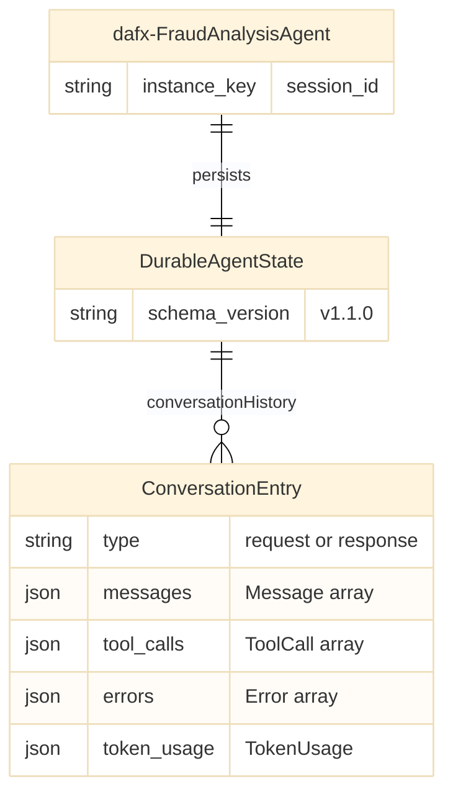

Every time the entity processes a request:
1. **Load** state from DTS → `DurableAgentState`
2. **Append** user message (alert or analyst feedback)
3. **Rebuild** full chat history from all entries
4. **Call** LLM with complete conversation
5. **Append** assistant response
6. **Persist** state back to DTS via `self.persist_state()`

This is why the agent can re-investigate with full context — the conversation history is a **durable, append-only log** stored in DTS, not in worker memory.

---

## Running the Demo

This section covers how to run the reference implementation locally to see the patterns in action.

### Prerequisites

- **Docker** — for DTS emulator
- **Python 3.12+** with **uv**
- **Node.js 18+** — for React UI
- **Azure OpenAI** — with a deployed chat model
- **MCP Server** — Contoso tools on port 8000

### Service Startup Order

```mermaid
%%{init: {'theme': 'base'}}%%
flowchart LR
    S1["1️⃣ DTS Emulator<br/>Port 8080"]
    S2["2️⃣ MCP Server<br/>Port 8000"]
    S3["3️⃣ Worker<br/>Pulls from DTS"]
    S4["4️⃣ Backend<br/>Port 8001"]
    S5["5️⃣ React UI<br/>Port 3000"]

    S1 --> S2 --> S3 --> S4 --> S5

    style S1 fill:#cce5ff,stroke:#004085
    style S2 fill:#d6d8db,stroke:#6c757d
    style S3 fill:#ffeeba,stroke:#ffc107
    style S4 fill:#d4edda,stroke:#28a745
    style S5 fill:#e8f4fd,stroke:#4A90D9
```

#### 1. Start DTS Emulator

```bash
docker run -d --name dts-emulator \
  -p 8080:8080 -p 8082:8082 \
  mcr.microsoft.com/dts/dts-emulator:latest
```

Dashboard: http://localhost:8082

> **Production:** Replace with Azure DTS — same SDK, just change `DTS_ENDPOINT`. See [provision_dts.ps1](provision_dts.ps1).

#### 2. Start MCP Server

```bash
cd mcp && uv run python mcp_service.py
```

#### 3. Start Worker

```bash
cd agentic_ai/workflow/fraud_detection_durable
uv sync && uv run python worker.py
```

#### 4. Start Backend

```bash
uv run python backend.py
```

#### 5. Start React UI

```bash
cd ui && npm install && npm run dev
# Open http://localhost:3000
```

---

## Demo Scenarios

### Scenario 1: Ambient Detection → Auto-Clear

Watch the event feed — a multi-country login anomaly triggers automatic investigation. The agent assesses low risk → auto-cleared without human involvement.

**What it proves:** Layer 1 rule engine triggering Layer 2 durable orchestration, with Layer 3 auto-clear path.

### Scenario 2: Ambient Detection → HITL Approval

A spending spike triggers investigation. Agent assesses high risk → analyst reviews in the UI → approves "lock account" → action executed.

**What it proves:** Full 3-layer flow including human-in-the-loop via durable external events.

### Scenario 3: Reject → Stateful Re-investigation

Analyst rejects with feedback "check if VPN usage." Agent re-investigates with **full conversation history** (original alert + first analysis + analyst feedback) and produces a refined assessment.

**What it proves:** Entity state persistence enables meaningful multi-turn investigation across the HITL feedback loop.

### Scenario 4: Kill & Recover — The Durability Proof 💥

This is the critical scenario — it proves the architecture delivers on its durability claims:

```mermaid
sequenceDiagram
    participant UI as Analyst
    participant BE as Backend
    participant DTS as DTS
    participant W1 as Worker v1

    UI->>BE: Start high-risk workflow
    BE->>DTS: schedule_new_orchestration()
    DTS->>W1: Work item: run orchestration
    W1->>W1: yield fraud_agent.run() ✅
    W1->>W1: yield notify_analyst() ✅
    W1->>DTS: yield wait_for_external_event()
    Note over W1: Status: Awaiting analyst review

    Note over W1: 💥 taskkill /F /IM python.exe

    participant W2 as Worker v2
    Note over W2: uv run python worker.py

    UI->>BE: POST /api/workflow/decision (approve)
    BE->>DTS: raise_orchestration_event()
    DTS->>W2: Orchestration has pending event
    W2->>W2: Replay: yield agent.run() → cached ✅
    W2->>W2: Replay: yield notify() → cached ✅
    W2->>W2: Resume: when_any() → event arrived!
    W2->>W2: yield execute_fraud_action() ✅
    Note over W2: Workflow completes normally! 🎉
```

**Steps:**
1. Start a high-risk workflow → reaches "Awaiting analyst review"
2. `taskkill /F /IM python.exe` — kill all Python processes
3. `uv run python worker.py` — restart the worker
4. Submit analyst decision via UI
5. **Workflow completes normally** — DTS replayed the orchestration from its event log

---

## Project Structure

```
fraud_detection_durable/
├── worker.py                       # DTS Worker: orchestration + agent entity + activities
├── backend.py                      # FastAPI BFF: REST API, WebSocket, SSE, event producer
├── event_producer.py               # Layer 1: telemetry generation + anomaly detection
├── fraud_analysis_workflow.py      # Inner workflow: fan-out → aggregate (Layer 2)
├── provision_dts.ps1               # Azure DTS provisioning script
├── .env                            # Configuration (Azure OpenAI, DTS, App Insights)
├── pyproject.toml                  # Dependencies
├── README.md                       # This file
├── PRODUCTION_ARCHITECTURE.md      # Production deployment on Azure Container Apps
└── ui/                             # React/Vite UI
    ├── src/
    │   ├── App.jsx                 # Main app: WebSocket + SSE connections
    │   └── components/
    │       ├── ControlPanel.jsx    # Alert selector + start button
    │       ├── WorkflowVisualizer.jsx  # React Flow DAG visualization
    │       ├── AnalystDecisionPanel.jsx  # HITL approve/reject/feedback
    │       └── EventFeed.jsx       # Live telemetry feed (Layer 1)
    └── package.json
```

## Configuration

| Variable | Description | Default |
|----------|-------------|---------|
| `AZURE_OPENAI_ENDPOINT` | Azure OpenAI endpoint | Required |
| `AZURE_OPENAI_CHAT_DEPLOYMENT` | Model deployment name | `gpt-4o` |
| `MCP_SERVER_URI` | MCP server URL | `http://localhost:8000/mcp` |
| `DTS_ENDPOINT` | DTS endpoint (local or Azure) | `http://localhost:8080` |
| `DTS_TASKHUB` | DTS task hub name | `default` |
| `ANALYST_APPROVAL_TIMEOUT_HOURS` | HITL timeout | `72` |
| `MAX_REVIEW_ATTEMPTS` | Max reject → re-investigate cycles | `3` |
| `EVENT_PRODUCER_ENABLED` | Enable Layer 1 event producer | `true` |
| `EVENT_INTERVAL_SECONDS` | Seconds between telemetry events | `3` |
| `BACKEND_OBSERVABILITY` | Enable Application Insights | `false` |

## Production Deployment

For Azure Container Apps deployment topology, Managed Identity security, KEDA scaling, and cost estimation, see:

👉 **[PRODUCTION_ARCHITECTURE.md](PRODUCTION_ARCHITECTURE.md)**

---

*Copyright (c) Microsoft. All rights reserved.*
